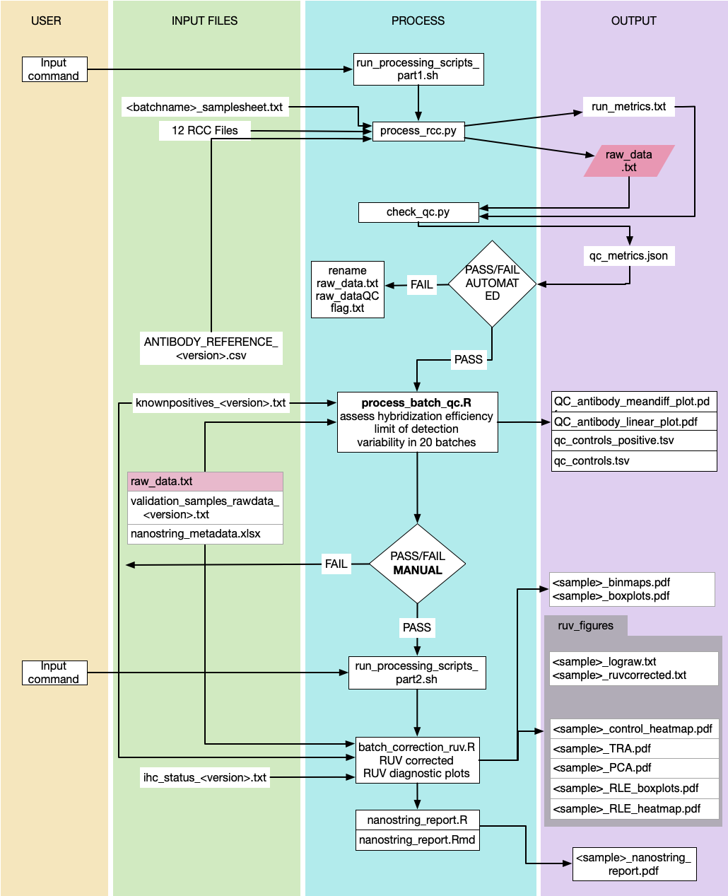

## Analysis of Nanostring nCounter Vantage Protein Assays
nCounter Digital Analyzer 5s
GeneRLF: NS_FFPE_STPath_Protein_v1.0
SystemAPF: 'n6_vDV1'
Output RCC FileVersion: 1.7
Nanostring SoftwareVersion: 4.0.1.8

Pipeline is currently run locally
 - Platform: x86_64-apple-darwin 15.6.0 (64-bit)
 - R version 3.5.2 (2018-12-20)
 - Python version Python 3.7.7

### Input files




```
The <batch_id> is an identifier provided by the technician. It is pre-pended to
the samplesheet which is sent to the analyst for processing.

`<batch_id>_samplesheet.txt`


Bash pipeline script using `run_processing_scripts.sh` which can be run like this:
```
run_processing_scripts.sh <batch_id>
run_processing_scripts.sh 20190314_208421591020

```

Current R processing scripts have dependency of custom nanoprot package. 
[nanoprot](https://github.com/patterja/nanoprot)


Scripts are dependent on multiple files:

### Raw RCC Data
[example in test-data](test-data/20190314_208421591020/20190314_208421591020_6celllines-2slides-031419_01.RCC)

### Samplesheet
[example in test-data](test-data/20190314_208421591020/20190314_208421591020_6celllines-2slides-031419_samplesheet.txt)

### ANTIBODY_REFERENCE.csv
Shows relationship antibody conjugates (rabbit/mouse) and helps with ordering of antibodies to keep phospho and total target together. Also includes pathway relationship of each antibody. 

```
#AbID,Antibody_name,Type,Target,Host,Pathway
4E-BP1,4E-BP1(53H11),total,4E-BP1,rabbit,"mTOR Pathway,RTK Pathway"
EGFR,EGF Receptor(D38B1),total,EGFR,rabbit,"MAPK-RAS Pathway,RTK Pathway"
GSK3B,GSK-3B(D5C5Z),total,GSK3B,rabbit,RTK Pathway
HER2,HER2/ErbB2(29D8),total,HER2,rabbit,"MAPK-RAS Pathway,RTK Pathway"
...
Histone H3,Histone H3(D1H2),total,HistoneH3,rabbit,Non-specific
MmAb-IgG1,MmAb-IgG1(MOPC-21),total,IGG,mouse,Non-specific
RbAb-IgG,RbAb-IgG(DA1E),total,IGG,rabbit,Non-specific
```

### knownpositives.txt
Filters control cell line and antibody combinations for "positive" signal. For batch QC. For each antibody cell lines shown to have a significantly postive signal were selected, however if none of the 6 control cell lines showed a positve signal for a particular antibody then all cell lines are included. 
We expect to see consistency within 3 standard deviations between each cell line-antibody signal. 
If it is >/<3SD for all cell lines and antibodies then batch fails. 
First five lines of knownpositives.txt
```
Cell line       Antibody        combined_name
HeyA8   4E-BP1  HeyA8__4E-BP1
MDA468.EGF      EGFR    MDA468.EGF__EGFR
MDA468.control  EGFR    MDA468.control__EGFR
MCF7    ERK1/2  MCF7__ERK1/2
HeyA8   ERK1/2  HeyA8__ERK1/2
...
```  

### validation_samples_rawdata_<valid_version>.txt
Matrix of rawdata for 20 batches run as a validation set. This is only used for batch pass and fail. 
Rows are features: ERCC controls, antibodies, etc
Columns are samples: labeled in the form of <batch_name>_<sample_name>

```
20190314_208421591020__HCC1954  20190314_208421591020__BT474    20190314_208421591020__MDA468 control.1	20190314_208421591020__BT474.1    20190314_208421591020__MCF7.1
POS_B(32)	4257	5345	3822	4183	3561	
POS_C(8)	2465	3067	2030	2310	2051
...
MmAb-IgG1	389	326	464	158	528	
RbAb-IgG	509	353	612	182	658	
Histone H3	92664	50931	116502	91911	306272
```

### ihc_status_<ihc_version>.txt
IHC metadata matrix. This is a matrix of the IHC status and will contain cohort information for data visualization and sub grouping into cohorts. Initially created from LabKey API but some samples in the cohort were not SMMART were annotated manually from EPIC. This will need to be updated manaully I think. 

```
index	Batch	Batch Name	RCC Filename	Sample Name	BEMS ID	Participant ID	Collection Date	Biopsy	Antibody Lot	Study	cohort	HER2	ER	PR	TNBC	AR	Ki-67	BCL-2	PD-L1	GATA-3	19	20	CK7	BEMS ID	Collection Date	Pathology Record Number
1	20190320_208421541020	SMMART2	20190320_208421541020_SMMART set#2-032019_12.RCC	PATHID#1	BEMSID#1	SMMARTIRBID#1	BIOPSYDATE#1	1	STP10004F	AMTEC	breast	NA	NA	NA	FALSE	NA	NA	NA	NA	NA	NANA	NA
2	20190403_208421421020	Validation	20190403_208421421020_SMMART set1 2 repeat-040319_10.RCC	PATHID#2 BEMSID#2	SMMARTIRBID#2	16113-110	5/30/18		STP10004F	SMMART	breast	Negative	Positive	Positive	FALSE	Negative	NA	NA	Negative	NA	NA	NA	NA
...
```

### nanostring_metadata.xlsx

Keeping this in excel. See Box Directory/NANOSTRING/nanostring_metadata.xlsx

```
Batch	Batch Name	RCC Filename	Sample Name	BEMS ID	Participant ID	Collection Date	Biopsy	Antibody Lot	Study	cohort
...
```
Filtered column Study=="SMMART" is uploaded to SMMART LabKey

